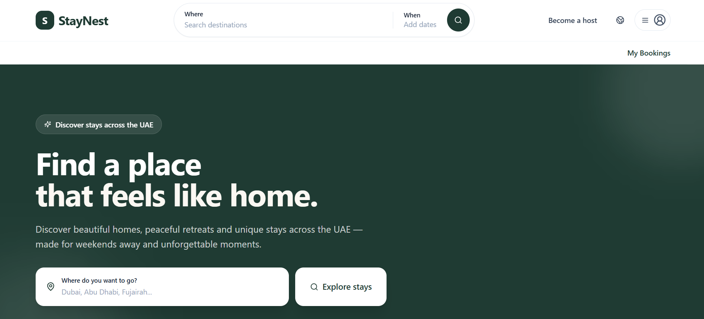
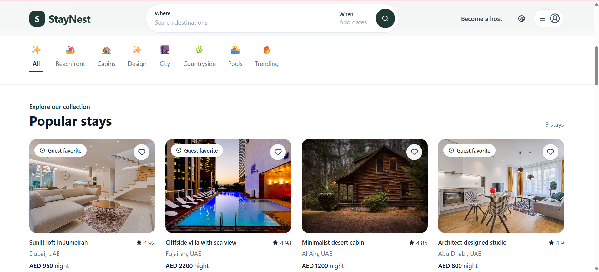
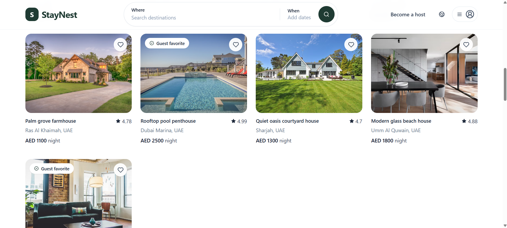
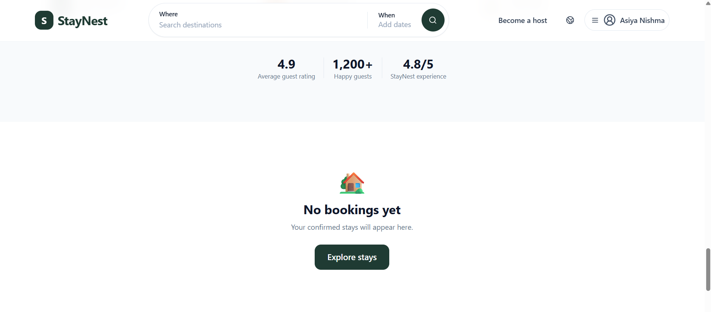
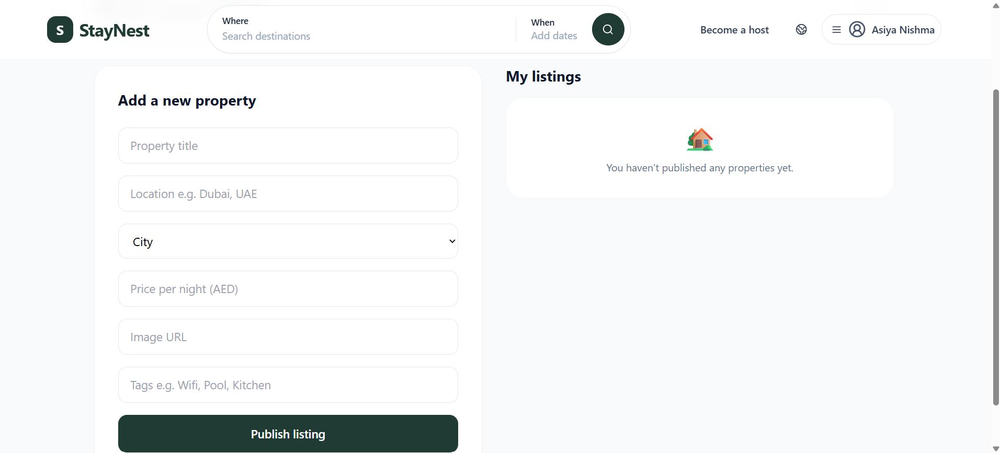

# StayNest 🏡

**StayNest** is a full-stack accommodation booking platform for discovering, filtering, and booking stays across the UAE.

The application includes user authentication, accommodation listings, search and filtering, booking management, JWT-protected functionality, and a host dashboard. The frontend is built with React.js and Vite, while the backend uses Node.js, Express.js, and MongoDB.

## 🚀 Live Demo

**Frontend:** https://staynest-iota-eight.vercel.app/
**Backend:** https://staynest-wrcs.onrender.com

> The backend is hosted on a free-tier service and may take a few seconds to respond after a period of inactivity.

---

## ✨ Features

### 👤 User Features

* User registration and login
* JWT-based authentication
* Browse accommodation listings
* Search stays by destination
* Filter listings by category
* View detailed property information
* Create bookings
* View personal bookings
* Cancel bookings

### 🏠 Host Features

* Dedicated Host Dashboard
* View accommodation listings
* Manage property information
* Manage accommodation details and pricing

### 🔎 Search & Discovery

* Destination-based search
* Category-based filtering
* UAE-focused destinations including:

  * Dubai
  * Abu Dhabi
  * Fujairah
  * Ras Al Khaimah
  * Al Ain
* Accommodation categories including:

  * Beachfront
  * Cabins
  * Design
  * City
  * Countryside
  * Pools
  * Trending

### 🎨 User Interface

* Responsive React interface
* Reusable React components
* Responsive navigation
* Accommodation listing cards
* Listing detail modal
* Booking interface
* Host dashboard
* Clean and responsive layout

---

## 🛠️ Tech Stack

### Frontend

* React.js
* JavaScript
* Vite
* Tailwind CSS
* Bootstrap
* REST API integration

### Backend

* Node.js
* Express.js
* RESTful APIs
* JWT Authentication
* Mongoose

### Database

* MongoDB
* MongoDB Atlas

### Deployment

* Vercel — Frontend
* Render — Backend
* MongoDB Atlas — Database

---

## 🏗️ Project Structure

```text id="z2w1j4"
StayNest/
│
├── src/
│   ├── components/
│   │   ├── Navbar
│   │   ├── ListingCard
│   │   ├── ListingModal
│   │   ├── FilterChips
│   │   ├── MyBookings
│   │   └── HostDashboard
│   │
│   ├── App.jsx
│   └── main.jsx
│
├── server/
│   ├── models/
│   ├── routes/
│   ├── middleware/
│   └── server.js
│
├── index.html
├── package.json
├── package-lock.json
├── vite.config.js
├── tailwind.config.js
├── postcss.config.js
└── README.md
```

---

## 🔄 Application Flow

```text id="d4g7b2"
User
 │
 ▼
Browse StayNest
 │
 ├── Search by destination
 │
 └── Filter by category
 │
 ▼
View Accommodation
 │
 ▼
Login / Register
 │
 ▼
Create Booking
 │
 ▼
My Bookings
 │
 └── Cancel Booking
```

---

## 🔐 Authentication

StayNest uses **JSON Web Tokens (JWT)** for user authentication.

After authentication, the frontend stores the user's token and sends it with protected API requests using the authorization header:

```text id="j0u5zq"
Authorization: Bearer <token>
```

Protected functionality includes booking management and authenticated host operations.

---

## 🔌 API Overview

The backend provides RESTful APIs for accommodation listings and booking management.

| Method | Endpoint                   | Purpose                         |
| ------ | -------------------------- | ------------------------------- |
| GET    | `/api/listings`            | Retrieve accommodation listings |
| POST   | `/api/bookings`            | Create a booking                |
| GET    | `/api/bookings`            | Retrieve user bookings          |
| DELETE | `/api/bookings/:bookingId` | Cancel a booking                |

---

## ⚙️ Getting Started

### Prerequisites

Make sure you have the following installed:

* Node.js
* npm
* MongoDB Atlas account

### 1. Clone the repository

```bash id="e6zq2p"
git clone https://github.com/asiyanishma/staynest.git
cd staynest
```

### 2. Install frontend dependencies

From the project root:

```bash id="p9x5l3"
npm install
```

### 3. Configure the frontend

Create a `.env` file in the project root:

```env id="k0p6y1"
VITE_API_URL=http://localhost:5000
```

For the deployed application:

```env id="a8c3w7"
VITE_API_URL=https://staynest-wrcs.onrender.com
```

> Do not commit `.env` files containing private credentials or secrets to GitHub.

### 4. Start the frontend

From the project root:

```bash id="h3q9vz"
npm run dev
```

The frontend will normally run at:

```text id="f1m6qs"
http://localhost:5173
```

### 5. Install backend dependencies

Open another terminal and navigate to the server:

```bash id="u2n7ka"
cd server
npm install
```

### 6. Configure the backend

Create a `.env` file inside the `server` directory with your MongoDB connection and authentication configuration:

```env id="r5d8xm"
MONGO_URI=your_mongodb_connection_string
JWT_SECRET=your_jwt_secret
PORT=5000
```

> Keep backend secrets private and never commit them to GitHub.

### 7. Start the backend

From the `server` directory:

```bash id="q7v1bn"
node server.js
```

The backend will run at:

```text id="c4m8ys"
http://localhost:5000
```

---

## 🌐 Deployment

### Frontend — Vercel

The React frontend is deployed using Vercel.

**Live application:**
https://staynest-iota-eight.vercel.app/

The production frontend connects to the deployed backend through the `VITE_API_URL` environment variable.

### Backend — Render

The Express backend is deployed using Render.

**Backend:**
https://staynest-wrcs.onrender.com

### Database — MongoDB Atlas

StayNest uses MongoDB Atlas for cloud database storage.

---

## 📸 Screenshots

### Home Page



### Listing Details





### My Bookings



### Host Dashboard



---

## 💡 Key Highlights

* Built a full-stack accommodation booking platform using React.js, Node.js, Express.js, and MongoDB
* Developed reusable React components for listings, navigation, filtering, bookings, and host management
* Integrated the React frontend with an Express.js REST API
* Implemented MongoDB data persistence using Mongoose
* Added JWT-based authentication and protected API functionality
* Implemented accommodation search and category filtering
* Developed booking creation, viewing, and cancellation workflows
* Connected the application to MongoDB Atlas
* Deployed the frontend and backend separately using Vercel and Render

---

## 🔮 Future Improvements

* Real-time booking availability
* Date-based availability checking
* Online payment integration
* Cloud image upload and storage
* Reviews and ratings
* Wishlist functionality
* Improved form validation
* Automated testing
* Real-time notifications

---

## 👩‍💻 Author

**Asiya Nishma**

Full-Stack Web Development

* GitHub: https://github.com/asiyanishma
* LinkedIn: https://www.linkedin.com/in/asiya-nishma

---

## 📄 License

This project was created as a portfolio project.
